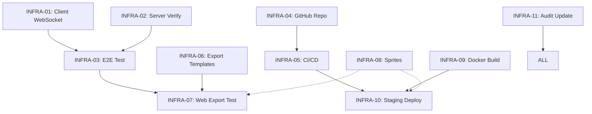

# Eclipse Realms — Infrastructure Sprint Coordination Document

**Sprint:** Days 1-3 Infrastructure Sprint  
**Date:** 2026-08-04  
**Coordinator:** Tomoe (Executive OS)  
**Status:** 🔄 IN PROGRESS — Protocol alignment underway

---

## 1. Sprint Overview

### Objective
Resolve all infrastructure blockers to achieve a working client-server WebSocket connection, GitHub repository with CI/CD, web export capability, and placeholder sprites in place.

### Success Criteria (End of Day 3)
- [ ] **Protocol Alignment:** Client (WebSocketMultiplayerPeer) ↔ Server (websockets on port 9051) verified working
- [ ] **GitHub Repo:** Created with proper `.gitignore`, branch protection, and team access
- [ ] **CI/CD Pipeline:** Automated Godot export on push (Linux + Web builds)
- [ ] **Export Templates:** Godot 4.4.stable templates installed and web export tested
- [ ] **Placeholder Sprites:** Player, NPC, monster, and tileset sprites in `client/assets/characters/` and `client/assets/environment/`
- [ ] **Staging Server:** Docker container running on staging environment

---

## 2. Task Matrix

| Task ID | Task | Owner | Dependencies | Day | Status | Completion Criteria |
|---------|------|-------|--------------|-----|--------|---------------------|
| **INFRA-01** | Switch NetworkManager.gd from ENet to WebSocketMultiplayerPeer | Shiki | — | 1 | 🔄 IN PROGRESS | Client connects to ws://localhost:9051, receives HELLO_REPLY |
| **INFRA-02** | Verify server.py WebSocket handler matches client message format | Sentinel | INFRA-01 | 1 | ⏳ PENDING | JSON messages parsed correctly, PING/PONG works |
| **INFRA-03** | Test end-to-end client-server WebSocket connection | Shiki + Sentinel | INFRA-01, INFRA-02 | 1 | ⏳ PENDING | Client → Server → Client round-trip < 50ms |
| **INFRA-04** | Create GitHub repository with proper Godot `.gitignore` | Root | — | 1 | ⏳ PENDING | Repo at github.com/StreetSmartNYC/eclipse-realms, main branch protected |
| **INFRA-05** | Configure CI/CD pipeline (Godot export on push) | Root | INFRA-04 | 2 | ⏳ PENDING | GitHub Actions workflow exports Linux + Web builds on push to main |
| **INFRA-06** | Download & install Godot 4.4.stable export templates | Shiki | — | 1 | ⏳ PENDING | `godot --export "Web" build/web/index.html` succeeds |
| **INFRA-07** | Test Web export locally | Shiki | INFRA-06 | 2 | ⏳ PENDING | Web build loads in browser, connects to server |
| **INFRA-08** | Create placeholder sprites (player, NPC, monster, tileset) | Mio | — | 1-3 | ⏳ PENDING | Assets in `client/assets/characters/` and `client/assets/environment/`, no Missing Resource errors |
| **INFRA-09** | Build & test Docker image for server | Sentinel | — | 2 | ⏳ PENDING | `docker-compose up` runs server, health check passes |
| **INFRA-10** | Deploy staging server | Root | INFRA-09 | 3 | ⏳ PENDING | Staging URL accessible, WebSocket + REST responding |
| **INFRA-11** | Update REALIGNMENT_AUDIT.md with sprint results | Tomoe | All above | 3 | ⏳ PENDING | Audit reflects current status, next sprint planned |

---

## 3. Protocol Alignment Specification

### Target Architecture
```
Client (Godot 4.4)                    Server (Python 3.12)
┌─────────────────────┐               ┌─────────────────────┐
│ WebSocketMultiplayerPeer │────── ws://localhost:9051 ──────▶│ websockets.serve()    │
│ Port: 9051          │               │ Port: 9051          │
│ Protocol: JSON      │◀──── JSON ──▶│ Protocol: JSON      │
└─────────────────────┘               └─────────────────────┘
```

### Message Format (Already Aligned)
```json
{
  "type": 0,                    // MessageType enum (0=HELLO, 1=HELLO_REPLY, etc.)
  "version": "0.1.0",           // PROTOCOL_VERSION constant
  "timestamp": 1691023456789,   // Unix milliseconds
  "sender": 1,                  // peer_id (0=server)
  "data": { ... }               // Message-specific payload
}
```

### NetworkManager.gd Changes Required
- **Already using WebSocketMultiplayerPeer** ✅ (lines 66, 136, 197)
- **Port already 9051** ✅ (line 21)
- **Message serialization: JSON → UTF-8 bytes** ✅ (lines 575-590)
- **Need to verify:** `create_client()` call format matches server expectations

### Server.py WebSocket Handler
- Listens on `0.0.0.0:9051` ✅ (line 402)
- Expects JSON messages ✅ (line 272)
- Sends HELLO_REPLY with `peer_id`, `protocol_version`, `player_data` ✅ (lines 260-265)
- Handles PING/PONG, PLAYER_UPDATE, CHAT_MESSAGE, COMMAND ✅

### Integration Test Checklist
- [ ] Client `connect_to_server("127.0.0.1", 9051)` → state becomes CONNECTING
- [ ] Server receives connection, assigns peer_id, sends HELLO_REPLY
- [ ] Client receives HELLO_REPLY → state becomes CONNECTED, emits `connection_established`
- [ ] Client sends PING → Server responds PONG → Client calculates ping
- [ ] Client sends PLAYER_UPDATE → Server broadcasts to other peers
- [ ] Client disconnects → Server saves player, broadcasts PLAYER_DISCONNECT

---

## 4. Team Assignments & Daily Sync

### Day 1 (2026-08-04) — Protocol & Repo Foundation
| Role | Primary Tasks | Sync Time |
|------|---------------|-----------|
| **Shiki** | INFRA-01 (WebSocket switch), INFRA-06 (export templates) | 10:00 AM EST |
| **Sentinel** | INFRA-02 (verify server handler), INFRA-03 (connection test with Shiki) | 10:00 AM EST |
| **Root** | INFRA-04 (GitHub repo), INFRA-05 (CI/CD config) | 10:00 AM EST |
| **Mio** | INFRA-08 (placeholder sprites - start) | 10:00 AM EST |
| **Tomoe** | Coordination, audit updates, blocker escalation | 10:00 AM EST |

### Day 2 (2026-08-05) — Export & CI/CD
| Role | Primary Tasks | Sync Time |
|------|---------------|-----------|
| **Shiki** | INFRA-07 (Web export test), support INFRA-03 if needed | 10:00 AM EST |
| **Sentinel** | INFRA-09 (Docker build/test) | 10:00 AM EST |
| **Root** | INFRA-05 (CI/CD complete), INFRA-10 (staging prep) | 10:00 AM EST |
| **Mio** | INFRA-08 (sprites continue) | 10:00 AM EST |

### Day 3 (2026-08-06) — Integration & Handoff
| Role | Primary Tasks | Sync Time |
|------|---------------|-----------|
| **Shiki** | Final Web export verification, staging test | 10:00 AM EST |
| **Sentinel** | Staging server verification | 10:00 AM EST |
| **Root** | INFRA-10 (staging deploy), DNS/SSL if needed | 10:00 AM EST |
| **Mio** | INFRA-08 (sprites complete), asset integration test | 10:00 AM EST |
| **Tomoe** | INFRA-11 (final audit update), sprint retrospective | 10:00 AM EST |

---

## 5. Dependency Graph



**Critical Path:** INFRA-01 → INFRA-03 → INFRA-07 (client export)  
**Parallel Path:** INFRA-04 → INFRA-05 → INFRA-10 (CI/CD + staging)  
**Asset Path:** INFRA-08 (independent, feeds into export & staging)

---

## 6. Completion Criteria Details

### INFRA-01: NetworkManager WebSocket Switch
- [ ] `WebSocketMultiplayerPeer` instantiated in `connect_to_server()`
- [ ] `create_client(host, port)` called with `ws://` scheme
- [ ] Signal connections: `peer_packet`, `peer_connected`, `peer_disconnected`, `server_disconnected`
- [ ] `multiplayer.multiplayer_peer = server_peer` assigned
- [ ] Connection timeout timer starts (30s)
- [ ] State machine transitions: DISCONNECTED → CONNECTING → CONNECTED

### INFRA-02: Server Handler Verification
- [ ] `websockets.serve()` bound to `0.0.0.0:9051`
- [ ] `_handle_websocket_client()` accepts connections
- [ ] JSON parse → `_handle_message()` routing works
- [ ] MSG_PING → MSG_PONG response < 5ms
- [ ] MSG_PLAYER_UPDATE → `_broadcast_player_update()` to other peers
- [ ] Disconnect → `_handle_disconnect()` saves player, broadcasts

### INFRA-03: E2E Connection Test
- [ ] Start server: `python server.py`
- [ ] Run Godot client headless: `godot --headless --script test_connection.gd`
- [ ] Verify: `connection_established` signal emitted
- [ ] Verify: Ping measured and logged
- [ ] Verify: Clean disconnect on client quit

### INFRA-04: GitHub Repository
- [ ] Repository created: `StreetSmartNYC/eclipse-realms`
- [ ] `.gitignore` applied (Godot, Python, OS, IDE)
- [ ] Branch protection: `main` requires PR review + CI pass
- [ ] Team members added with write access
- [ ] `develop` branch created for ongoing work

### INFRA-05: CI/CD Pipeline
- [ ] GitHub Actions workflow: `.github/workflows/export.yml`
- [ ] Trigger: push to `main` or `develop`
- [ ] Job: Install Godot 4.4, download export templates
- [ ] Job: Export Linux/X11 build → upload artifact
- [ ] Job: Export Web build → upload artifact
- [ ] Job: Build Docker image → push to GHCR

### INFRA-06: Export Templates
- [ ] Run: `godot --export-template 4.4.stable`
- [ ] Verify: Templates in `~/.local/share/godot/export_templates/4.4.stable/`
- [ ] Verify: `linux_debug.x86_64`, `linux_release.x86_64`, `web_*` present

### INFRA-07: Web Export Test
- [ ] Run: `godot --headless --export "Web" build/web/index.html`
- [ ] Verify: `build/web/index.html`, `.js`, `.wasm`, `.pck` generated
- [ ] Serve with `python -m http.server 8080` in `build/web/`
- [ ] Open `http://localhost:8080` in browser
- [ ] Verify: Game loads, main menu renders
- [ ] Verify: WebSocket connection to `ws://localhost:9051` works (CORS permitting)

### INFRA-08: Placeholder Sprites
| Asset | Path | Spec |
|-------|------|------|
| Player idle | `client/assets/characters/player/idle.png` | 64x64, 4 frames |
| Player walk | `client/assets/characters/player/walk.png` | 64x64, 8 frames |
| Player run | `client/assets/characters/player/run.png` | 64x64, 8 frames |
| NPC villager | `client/assets/characters/npc/villager.png` | 64x64, 4 frames |
| Monster slime | `client/assets/characters/monster/slime.png` | 64x64, 4 frames |
| Tileset oakrest | `client/assets/environment/oakrest/tileset.png` | 256x256, 16x16 tiles |

### INFRA-09: Docker Build
- [ ] `docker build -t eclipse-realms-server -f server/docker/Dockerfile server/`
- [ ] `docker-compose up -d` starts container
- [ ] Health check: `curl http://localhost:9052/api/hello` returns 200
- [ ] WebSocket: `wscat -c ws://localhost:9051` connects
- [ ] Logs show: `[SERVER] WebSocket server on port 9051`, `[SERVER] REST API on port 9052`

### INFRA-10: Staging Deploy
- [ ] Server accessible at `staging.eclipse-realms.streetsmartnyc.com` (or similar)
- [ ] WebSocket: `wss://staging.eclipse-realms.streetsmartnyc.com:9051`
- [ ] REST: `https://staging.eclipse-realms.streetsmartnyc.com:9052/api/hello`
- [ ] SSL/TLS configured (Let's Encrypt or self-signed for staging)
- [ ] Auto-restart on crash (`restart: unless-stopped`)

### INFRA-11: Audit Update
- [ ] REALIGNMENT_AUDIT.md updated with Day 1-3 results
- [ ] Protocol mismatch → RESOLVED
- [ ] Export templates → INSTALLED
- [ ] GitHub repo → CREATED
- [ ] CI/CD → CONFIGURED
- [ ] Staging → DEPLOYED
- [ ] Sprites → IN PLACE
- [ ] Next 3-day plan documented

---

## 7. Blocker Escalation Path

| Blocker | Owner | Escalation |
|---------|-------|------------|
| Godot WebSocket API changes | Shiki | Check Godot 4.4 docs, fallback to raw WebSocketPeer |
| Server WebSocket lib issues | Sentinel | Verify `websockets` version, consider `aiohttp` WS |
| Export template download fails | Shiki | Manual download from godotengine.org |
| CI/CD Godot install fails | Root | Use `barichello/godot-ci` Docker image |
| Sprite creation delayed | Mio | Use colored rectangles as ultimate fallback |
| Staging DNS/SSL issues | Root | Use ngrok/tailscale for immediate tunnel |

---

## 8. Communication Channels

- **Primary:** Discord #eclipse-realms-infra (text standups)
- **Voice:** Friday 3 PM EST (weekly sync)
- **Issues:** GitHub Issues (tag `infra-sprint`)
- **PRs:** Required for all changes to `main`/`develop`
- **Emergency:** Direct message Tomoe (coordinator)

---

## 9. Risk Register

| Risk | Probability | Impact | Mitigation |
|------|-------------|--------|------------|
| WebSocket protocol edge cases | Medium | High | Test with simple Python client first |
| Godot 4.4 export template mismatch | Low | High | Pin exact version 4.4.stable |
| CI/CD timeout on export | Medium | Medium | Increase runner timeout, cache templates |
| Sprite asset pipeline issues | Low | Medium | Use simple PNG, avoid complex formats |
| Staging deployment failures | Medium | Medium | Test Docker locally first, use ngrok fallback |

---

## 10. Definition of Done (Sprint)

The Infrastructure Sprint is **complete** when:

1. ✅ **Client connects to server via WebSocket** — Verified with automated test
2. ✅ **GitHub repo exists with CI/CD** — Green check on `main` branch
3. ✅ **Web export works** — Loads in browser, connects to local server
4. ✅ **Docker image builds & runs** — Health check passes
5. ✅ **Staging deployed** — Accessible via URL
6. ✅ **Placeholder sprites in place** — No Missing Resource errors in editor
7. ✅ **Audit updated** — Next sprint planned with clear tasks

---

## 11. Next Sprint Preview (Days 4-6)

| Focus | Tasks |
|-------|-------|
| **Gameplay Loop** | Main Menu → Character Creation → Oakrest Village → Combat → Save |
| **Multiplayer** | Position sync, player list, chat |
| **Content** | Moss Slime AI, basic quest, level up |
| **Polish** | Audio integration, UI feedback, transitions |

---

*Document maintained by Tomoe (Executive OS)*  
*Last updated: 2026-08-04 02:05 UTC*