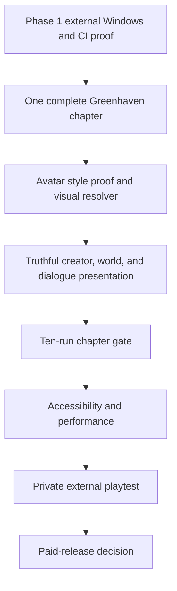

# Eclipse Realms — Current Release Ledger

**Updated:** 2026-08-17  
**Decision status:** active execution baseline  
**Canonical plan:** [Release Readiness Master Plan](./RELEASE_READINESS_MASTER_PLAN.md)  
**Avatar contract:** [Avatar System Plan](../../AVATAR_SYSTEM_PLAN.md)

> [!IMPORTANT]
> This ledger supersedes live-status claims in historical sprint and team-board documents. A status is `verified` only with current code or test evidence; it is `planned` when it describes future work.

## Product decision

The release target is a local-first Windows **Greenhaven Prologue**: one complete 2D RPG chapter, local saves, one complete calling, and no public online service. The backend and multiplayer prototype remain future work, not a launch promise. [Master plan](./RELEASE_READINESS_MASTER_PLAN.md)

## Reconciled delivery status

| Area | Status | Evidence / decision |
| --- | --- | --- |
| Product scope | **Verified direction** | Premium, local-first PC prologue; public service work is excluded from the first release. [Master plan](./RELEASE_READINESS_MASTER_PLAN.md) |
| Creator and local profile | **Verified** | The vertical slice reaches character creation and Oakrest; schema-v2 records preserve identity, ancestry, calling, and private-by-default profile fields. |
| Inclusive avatar data model | **Verified foundation** | Stable appearance, species, calling, and cosmetic catalogs keep presentation separate from mechanics. [Avatar contract](../../AVATAR_SYSTEM_PLAN.md) |
| Honest avatar presentation | **Not complete** | Enabled Human, Elf, and Dwarf records all resolve to the Human Adept avatar. The planned reusable visual resolver/controller is absent. [Avatar contract](../../AVATAR_SYSTEM_PLAN.md) |
| Release automation | **Implemented; external proof pending** | Version metadata, artifact manifests, catalog checks, corrected export-template handling, and local packaged-build smoke evidence exist. Clean CI and two clean Windows-machine checks remain. [Master plan](./RELEASE_READINESS_MASTER_PLAN.md) |
| Local persistence | **Verified regression evidence** | Save/load completed with 80 passed and 0 failed assertions on 2026-08-17. Existing headless cleanup warnings remain a quality item. |
| Greenhaven chapter | **In progress** | Menu → creator → Oakrest is demonstrated; a full restart-safe quest, combat, loot, equipment, climax, and ending path is not yet proven. [Master plan](./RELEASE_READINESS_MASTER_PLAN.md) |
| Online service and commerce | **Deferred** | Neither meets public-release security, authority, operational, or entitlement gates. [Master plan](./RELEASE_READINESS_MASTER_PLAN.md) |

## Reached goals

1. Functional first-playable baseline: main menu, inclusive creator, local profile, Oakrest transition, data catalogs, and local saves.
2. Character data separates identity/profile data from gameplay choices.
3. Release foundation includes version metadata, catalog validation, artifact checksum generation, and packaged Linux smoke evidence.
4. The product plan has been narrowed away from premature MMO and free-to-play work. [Master plan](./RELEASE_READINESS_MASTER_PLAN.md)

## Current implementation checkpoint

**Tutorial-loop contract: verified.** The new Greenhaven loop test proves: tutorial acceptance; Moss Slime defeat advancing to the Elder Mira return objective; completion only after the return; exact-once reward grants; and completed-state persistence through save/reload. The existing creator-to-Oakrest and save/load regressions also pass.

**Repair delivered:** quest progress now tracks an objective index and progress count, consumes catalog `amount` values with `count` compatibility, persists the state, and receives return events from NPC interaction. This closes the first chapter-path defect; it does not prove the broader chapter or the final ending.

**Resolved checkpoint:** NPC quest lists now use canonical quest IDs, and the offer contract is covered by the Greenhaven loop test. The visual proof is the next parallel presentation lane. [Start brief](./GREENHAVEN_FIRST_COMPLETE_LOOP_START_BRIEF.md)

### Phase 2 automated completion — 2026-08-17

**Verified:** the Greenhaven contract now covers tutorial, amulet fetch, merchant escort, Wolf Hunt, Thorn Wisp clear, Cave Guardian, exact-once rewards, equipment-stat changes, checkpoint save/reload, and final chapter save/reload. It passed ten consecutive automated runs; character-profile, release-catalog, creator-to-Oakrest, and save/load regressions also pass. Mosswood, Hunter's Camp, and Whispering Caverns boot without script errors.

**Delivered repairs:** canonical NPC quest lists; public NPC offer lookup; ordered quest objective state; kill, find, escort, and return events; authored amulet and camp-arrival triggers; forest-to-camp routing; scene-transition state preservation; objective-state persistence; exact-once completion rewards; player-owned equipment/unequip APIs with stat recalculation; authored encounter counts matching quest targets; parse-safe scene-local monster spawning; and support for the existing `ColorRect` placeholder sprites in active world scenes.

**Acceptance evidence still required:** ten manual authored-world playthroughs, alternating fresh and checkpoint-reload routes. Record scene-transition, spawn, combat, dialogue, audio, death/retry, and final-ending behavior. Headless contract evidence is not a substitute for this visual/gameplay review.

**Next phase after manual acceptance:** begin the [avatar visual proof](../../AVATAR_SYSTEM_PLAN.md) with Human Adept, Elder Mira, and Moss Slime; do not enable additional visual presets until preview, world, dialogue, and save/load agree.

## Remaining gates

- **Phase 1 proof:** green clean CI; two independent Windows installs that boot, create, save, reload, and exit; archived artifact/test evidence; tracked cleanup warnings.
- **Chapter completion:** one deterministic title → creator → Oakrest → field → combat/loot/equipment → quest return → climax → ending/reward path; ten consecutive successful internal runs; no save/progression/duplication blocker.
- **Avatar truthfulness:** catalog-backed visual resolver; first style proof of Human Adept, Elder Mira, and Moss Slime; only then curated Human, Elf, and Dwarf presets with matching preview, world sprite, and portrait.
- **Governance:** reviewed dirty worktree; complete asset-provenance ledger; resolved separately reported source-exposure risk before public deployment. [Master plan](./RELEASE_READINESS_MASTER_PLAN.md)

## Realigned continuation sequence

## Active work package: Greenhaven First Complete Loop

**Done when:**

- A new player completes the single chapter path locally without developer intervention.
- Save/relaunch/reload retains valid progress at every checkpoint.
- Player, Elder Mira, and Moss Slime use the catalog-backed presentation pipeline.
- Tests cover creator-to-world choice, one complete quest loop, and mid-chapter save/reload.

**Out of scope:** extra jobs, layered avatars, public networking, commerce, web/mobile exports, and new social systems.

**Implementation brief:** [Greenhaven First Complete Loop — Start Brief](./GREENHAVEN_FIRST_COMPLETE_LOOP_START_BRIEF.md)

## Historical planning material

- [Sprint 1: First Playable](./SPINT_01_FIRST_PLAYABLE.md) is a historical foundation checklist; its “ready to start” state is obsolete.
- [Team status board](../TEAM_STATUS.md) is a 2026-08-03 snapshot; its branch, owner, and CI details are not current.
