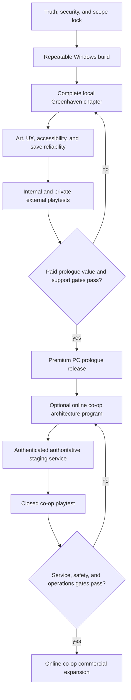

# Eclipse Realms — Release Readiness Master Plan

**Status:** active execution plan — 2026-08-17  
**Planning horizon:** first paid PC release, then optional online co-op program  
**Source of truth:** this plan defines the approved sequence; the [current release ledger](./RELEASE_LEDGER_2026-08-17.md) records verified progress, open gates, and the next work package. Older audits remain historical evidence, not release approval.

## 1. Executive decision

Eclipse Realms is currently a promising first-playable Godot prototype. It is **not** safe to launch as an MMORPG, free-to-play service, or monetized multiplayer game.

The recommended commercial path is deliberately smaller:

1. Build a polished, local-first Windows **Greenhaven Prologue**: a 90–150 minute premium 2D RPG chapter with a complete ending, local saves, one complete calling, and no public online service.
2. Validate it through a private free playtest, then a public free demo/prologue if appropriate.
3. Charge only when the current build is a complete, accurately represented small game.
4. Treat authenticated 2–4 player online co-op as a separate program. Do not sell a live-service promise until its authority, safety, support, and recovery gates have passed.

This preserves the long-term world vision without funding unfinished server infrastructure with player trust. If online co-op is non-negotiable for the first paid release, every **Online Co-op gate** in this plan becomes a prerequisite to charging.

### Product promise for the first sellable release

> A hand-built 2D adventure RPG prologue: create a character, explore Greenhaven, complete a short quest arc, fight readable enemies, earn and equip gear, defeat a climax encounter, and keep a local save.

### Explicit non-goals before the first paid release

- No MMORPG/shared-world claim, guilds, trading, auction house, PvP, regional matchmaking, or live economy.
- No web, mobile, iOS, Android, cross-play, subscriptions, battle pass, ads, premium currency, loot boxes, or randomized paid rewards.
- No paid identity, pronoun, body-frame, genderfluid-look, accessibility, or gameplay choices.
- No more jobs until each has complete combat, animation, equipment, balance, tutorial, and test support.
- No user-generated content, direct messages, global chat, or public profile system.

## 2. Current evidence and hard stops

| Area | Current evidence | Release implication |
| --- | --- | --- |
| Client | Main menu → creator → Oakrest works; save/profile schema v2, six zones, NPC/monster/quest data, and headless tests exist. | Good vertical-slice base; not yet a complete commercial chapter. |
| Character art | Human, Elf, and Dwarf all resolve to `pc_human_adept_01`; appearance catalogs exceed visible runtime art. | Never expose a visual option until it changes preview/world/portrait truthfully. |
| Gameplay | Quest, equipment, respawn, loot, zone, and save paths are partly implemented but not proven as one full restart-safe loop. | Complete and test one loop before expanding content. |
| Networking | Client networking is scaffolding; multiplayer tests are largely simulated. | Do not market multiplayer until real clients pass against a real server. |
| Server | Connection `peer_id` is transient; REST player/save routes are not account-authorized; WebSocket has no authenticated handshake; SQLite and Postgres implementations diverge. | Do not expose the server publicly or take online payments. |
| Operations | Docker/CI shapes exist, but no migrations, production secrets model, TLS/WSS, monitoring, backups, or rollback proof. | No public service until staging and recovery drills exist. |
| Commerce | No payment, receipt, entitlement, refund, tax, or support system exists. | First paid release should use the PC store as merchant flow, not in-game checkout. |

### Immediate P0 stops

1. Do not publish ports 9050–9052 or represent online play as available.
2. Remove or protect the externally reported `omakase_pi.php` source-exposure path outside this repository; rotate any potentially exposed credentials. This is an independent security incident, not a future backlog item.
3. Resolve the dirty worktree and document asset provenance before release work continues. No current generated concept-reference image may ship without a documented commercial-rights decision.
4. Create one dated release ledger. It must record the exact commit, artifact checksum, Godot version, export-template source, test evidence, open risks, owner, and go/no-go decision.

## 3. Dependency map



## 4. Architecture rules that keep future options open

### Client and content

- Preserve the existing `CharacterProfile` schema-v2 migration boundary. Use stable IDs—never display labels or asset paths—as data references.
- Keep identity, pronouns, and profile-sharing optional, private-by-default data. They never affect stats, job access, animation, equipment, or entitlement.
- Keep ancestry cosmetic/lore-only unless a documented and balanced design later changes that rule. A calling owns combat stats, skills, gear, and growth.
- Add a content manifest containing `content_version`, `asset_version`, `save_schema_version`, and `protocol_version`. Validate cross-catalog references in CI.
- Use a curated preset avatar pipeline first. Future layered avatars must share pivot, frame layout, animation actions, portraits, and a flattened preview; do not begin broad combinatorial layering until the preset renderer is proven.
- Separate local/offline saves from later account-owned online characters. They must never merge silently.

### Future online service

When online co-op begins, use a **modular Python monolith**, PostgreSQL, HTTPS, and WSS. Do not add microservices, Kubernetes, ENet, Redis, or MMO sharding before a measured need exists.

```text
Godot client
  ├─ HTTPS: auth, bootstrap, character list
  └─ WSS: lobby, player intents, snapshots, chat
        ↓
Python modular monolith
  ├─ auth/session and lobby
  ├─ 2–4 player instance simulation
  ├─ authoritative rewards/progression
  └─ PostgreSQL persistence
```

- Stable identifiers: `account_id`, `character_id`, `session_id`, `instance_id`. A socket connection ID is never persistent identity.
- Clients submit intents. The server validates movement, cooldown/range, combat, quest progress, loot, inventory, currency, and equipment, then writes outcomes transactionally.
- Start at a fixed 20 Hz simulation / 10 Hz snapshot target, with interpolation for remote players. Profile data is not included in public packets unless explicitly opted in.
- Start with invitation-code sessions and a four-player hard limit in one region. This is the learning vehicle for later scalable services.

### Future commerce

Do not build in-game commerce for the local premium release. Design the interface now, but implement it only after accounts and server authority are real:

```text
Store/provider event → signature verification → immutable commerce ledger
  → idempotent entitlement grant/revoke → server-approved cosmetic catalog
```

Required records: `commerce_event`, `purchase`, `entitlement`, `catalog_item`, `refund_or_revocation`, and `delivery_attempt`. Client code never grants ownership or applies paid state directly.

## 5. Delivery phases and exit gates

### Phase 0 — Truth, ownership, and scope lock (week 1)

**Outcome:** one commercially coherent target and a reliable baseline.

1. Approve the first-release brief: Windows, local-first, premium prologue, one complete Adept calling, one full starter arc, no public networking.
2. Assign accountable owners: product/scope, engineering release, art/IP, privacy/legal, support, finance/tax, and security. One person may hold multiple roles, but each responsibility needs a named owner.
3. Create short ADRs for launch scope, offline vs. online character persistence, protocol transport, account identity, content source of truth, and monetization ethics.
4. Reconcile conflicting status documents. Mark old audits as historical; maintain a single release ledger and defect board.
5. Audit all source art, fonts, music, code, AI-assisted references, plugins, and contractor work. Record owner, source, license, commercial permission, attribution, and modified status.
6. Confirm the app name, domains, support mailbox, publisher/payee entity, and trademark-search plan with qualified counsel before spending on store assets.

**Likely paths:** `README.md`, `AVATAR_SYSTEM_PLAN.md`, `docs/production/`, `docs/technical/03_TECHNICAL_ARCHITECTURE.md`, `client/resources/game_data/*.json`.

**Exit gate:** launch contract is signed off; every candidate feature is tagged `launch`, `post-launch`, or `cut`; no known public source exposure remains; assets have a provenance owner.

### Phase 1 — Release foundation and reproducible Windows builds (weeks 1–2)

**Outcome:** every release candidate is reproducible, testable, and reversible.

1. Pin Godot version and use verified official export templates. Make CI fail on download, checksum, extraction, export, or artifact validation failure.
2. Build Windows on a clean runner; install and launch the artifact on a clean Windows target. Keep Web/Linux experimental until equally verified.
3. Run and retain evidence from boot, vertical-slice, profile migration, save/load, comprehensive validation, and data-catalog tests.
4. Add a release manifest: build version, Git SHA, Godot/export-template version, asset/content/schema version, SHA-256 checksums, known issues, and test result links.
5. Preserve previous stable artifacts and document rollback. Never make save-breaking changes without a migration, backup, and release note.
6. Add automated checks for missing assets, broken catalog IDs, malformed JSON, and placeholder/test artifacts in export candidates.

**Likely paths:** `client/export_presets.cfg`, `client/project.godot`, `client/tests/`, `.github/workflows/godot-export.yml`, `docs/WEB_EXPORT_PROCESS.md`, proposed `tools/ci/` and `docs/release/`.

**Exit gate:** a clean CI runner builds a Windows artifact, its checksum/manifest are produced, and two clean machines install, boot, create a character, save, reload, and exit successfully.

### Phase 2 — Finish one truthful Greenhaven chapter (weeks 2–6)

**Outcome:** a new player can reach a satisfying ending with no developer intervention.

1. Define the chapter path: title → creator → Oakrest tutorial → field zone → combat/loot/equipment → quest return → climax encounter/boss → ending/reward.
2. Complete generic quest objectives: kill, collect/find, interact/return, escort if retained, prerequisites, reward delivery, failure/retry, and idempotency.
3. Make zone transitions, spawn points, monster lifecycle/respawn, drop ownership, boss reset, scene reload, audio transitions, death/retry, and pause states deterministic.
4. Establish one derived-stat authority. Equipment must affect real combat consistently; clamp health/mana after recalculation and test all equip/unequip cases.
5. Define inventory rules: item ownership, stack limits, overflow, buy/sell, currency bounds, loot tables, and no duplication on save/reload.
6. Replace dead paths or repair them before expanding scope—especially `client/scripts/world/monster_spawner.gd`, which currently is not a production-ready architecture component.
7. Build a complete local save scenario: create → progress → save → quit → relaunch → reload → complete. Test malformed and older saves safely.

**Likely paths:** `client/scripts/player/player.gd`, `client/scripts/entities/{monster,npc}.gd`, `client/scripts/world/`, `client/scripts/ui/{inventory,equipment,quest_log,dialogue,hud}.gd`, all target world scenes, and game-data catalogs.

**Exit gate:** 10 consecutive internal runs complete the whole chapter; save/load survives restart and old-data migration; no progression, duplication, or data-loss blocker remains.

### Phase 3 — Avatar, NPC, monster, and presentation production (weeks 2–7; overlaps Phase 2)

**Outcome:** the visible game matches its inclusive creator and its commercial presentation.

1. First prove the style with Human Adept, Elder Mira, and Moss Slime. Verify ground anchors, camera readability, shadows, portrait/world consistency, and idle/walk timing.
2. Ship curated, freely selectable presentation presets for Human, Elf, and Dwarf. Each enabled avatar has a real 48×48 world sheet, neutral portrait, collision footprint, pivot, art source record, and fallback test.
3. Ship the five named NPCs, three monsters, and Cave Guardian with consistent visual language. Resolve the Elder Mira / `npc_elder_alric` name mismatch before producing final art.
4. Wire `avatar_visuals.json` through a reusable visual resolver/controller so creator, world, dialogue, save/load, and eventual public multiplayer payload use the same resolved `avatar_id`.
5. Keep face, hair, tone, body-frame, and cosmetic controls hidden until they change a world preview and portrait. All current and future starter appearance is free; presentation never changes stats.
6. Add attack/hit/death and four-direction art only after the core idle/walk/portrait pipeline works. Add full layered customization only after curated presets are stable.

**Likely paths:** `client/resources/game_data/avatar_visuals.json`, `species.json`, `appearance_options.json`, `cosmetics.json`, `client/scripts/visual/` (new), `client/scripts/ui/character_creation.gd`, `client/scripts/ui/dialogue.gd`, entity scripts, character assets, and scenes.

**Exit gate:** every enabled creator option produces an honest preview/world/portrait result and survives save/load/zone transitions; no enabled content points at placeholder art; every shipping asset has provenance and license evidence.

### Phase 4 — UX, accessibility, localization, and performance (weeks 5–8)

**Outcome:** the chapter is understandable and usable on supported Windows hardware.

1. Support keyboard, mouse, controller, and clear visible focus order. Add input rebinding and persistence.
2. Add UI/text scale, high contrast, non-color-only signals, reduced motion/flash and screen-shake controls, subtitles/captions or audio-cue equivalents, text speed, hold/toggle options, and readable notifications.
3. Test UI at 16:9, 16:10, 4:3, ultrawide, windowed resize, and minimum supported resolution. Move critical fixed-position UI to responsive containers/anchors.
4. Extract user-facing text to localization keys. Ship English only until another language has complete text, fonts, overflow checks, and proofread coverage; do not advertise incomplete languages.
5. Define target hardware and budgets for boot time, frame time, memory, build size, and load/scene-transition time. Profile on minimum-spec hardware.
6. Add a consented, data-minimized crash/feedback path only after privacy review. No raw character name, identity, pronouns, custom text, chat, IP address, or payment data in telemetry.

**Likely paths:** `client/scenes/ui/`, `client/scripts/ui/`, `client/scripts/autoload/{input_manager,localization,ui_manager}.gd`, `client/resources/localization/`, `client/project.godot`.

**Exit gate:** a first-time tester completes the chapter with keyboard and controller; UI remains legible at supported resolutions; all shipping text is localized or intentionally English-only; performance budgets pass on target hardware.

### Phase 5 — Internal alpha and private external playtest (weeks 8–10)

**Outcome:** evidence that the game is stable, understandable, and worth expanding.

1. Run 10–20 scripted internal sessions; triage every crash, confusion point, progression stop, save issue, and accessibility failure.
2. Distribute a free, restricted Windows build through itch.io keys or another private PC channel. Do not require a public backend or account.
3. Run 20–50 external sessions. Use an opt-in survey and support inbox; avoid collecting sensitive profile text or unnecessary identifiers.
4. Instrument only consented coarse events: boot result, creator started/completed, tutorial steps, first combat/death, quest complete, save success/failure, session duration, broad platform/build, and error code.
5. Publish release notes, known issues, feedback terms, and a clear statement that the test is not a purchase.

**Exit gate:** no repeatable data-loss/progression P0 or P1; ≥80% of test players reach first combat; ≥70% complete a 30-minute session; launch stability is at least 99% in the tested sample; support load is manageable by the named owner.

### Phase 6 — Paid Greenhaven Prologue decision and PC launch (weeks 10–14+)

**Outcome:** a defensible first revenue release with no live-service dependence.

1. Decide whether the tested chapter is worth charging for. If not, keep it free and use feedback to improve the next chapter; do not sell an incomplete demo as a finished product.
2. Prefer one transparent premium price and one product. A provisional range of USD $7.99–$12.99 needs market research, tax advice, and value testing before approval.
3. Use itch.io initially if it best fits the business/tax setup; prepare a Steam page and wishlists in parallel once trailer/capsule/screenshot content is truthful. Steam Early Access must only follow a playable, valuable current build—not serve as crowdfunding.
4. Deliver truthful screenshots, trailer, description, feature list, system requirements, credits, third-party notices, privacy notice, terms/EULA, refund/support process, accessibility statement, and appropriate content/age disclosure.
5. Maintain a 90-day funded patch/support plan independent of optimistic sales. Retain a stable previous build and publish a clear rollback/known-issues process.

**Exit gate:** at least 30 external near-final testers; ≥75% understand the objective without help; ≥70% judge the current chapter complete for its stated scope; all store media is current build footage; no open security, save, progression, accessibility, or licensing blocker; support and finance owners are prepared.

## 6. Optional online co-op program — do not start public monetization first

### Phase 7 — Contract, persistence, and server reconstruction (after local proof)

**Outcome:** an authenticated, deterministic foundation for closed co-op testing.

1. Retire transient `peer_id` as persistence identity. Create account/character/session/instance IDs and one canonical player-record schema including `job_id`, `species_id`, appearance/profile/cosmetic data, `schema_version`, revisions, and timestamps.
2. Choose PostgreSQL for staging/production and SQLite for local-only development. Add numbered reversible migrations, connection pooling, indexes, transactions, backup/restore tests, and no one-shot production `init.sql` dependency.
3. Split `server/server.py` into configuration, protocol validation, auth/session, HTTP routes, WebSocket gateway, lobby, simulation, repositories, observability, and health modules. Keep it one deployable service.
4. Replace username/password as the long-term commercial identity with platform identity (Steam ticket / entitlement) at paid co-op launch. Temporary closed-test auth must still use secure password/session policy.
5. Define a versioned protocol with schemas, maximum message sizes, sequence/request IDs, generic client errors, and compatibility rules.
6. Add authorization to every account/player route; never put session secrets in query strings; authenticate and bind WSS before accepting gameplay messages.

**Likely paths:** `server/server.py`, `server/auth/__init__.py`, `server/database/init.sql`, `server/requirements.txt`, `server/docker/`, `client/scripts/autoload/network_manager.gd`, proposed `server/app/`, `server/migrations/`, `server/tests/`, `shared/protocol/`, and `shared/schemas/`.

**Exit gate:** migrations initialize a disposable PostgreSQL database; registration/auth/bootstrap use a stable account; reconnect/restart retains identity; no unauthenticated player read/write route remains; stale/invalid messages are rejected without internal error disclosure.

### Phase 8 — Authoritative four-player Greenhaven co-op slice (after Phase 7)

**Outcome:** actual clients play one entire authoritative session.

1. Implement create/join/leave/ready lobby, invite codes, party roster, `instance_id`, and remote-player rendering.
2. Validate movement bounds/rate, attacks/cooldowns/range, monster state, damage, XP, loot, inventory, equipment, quest rewards, and currency server-side. Clients submit intents, never results.
3. Add reconnect grace period, resync snapshots, duplicate-command protection, disconnect cleanup, and server checkpoints.
4. Convert one region, one monster, one quest, and one boss loop before networking all zones.
5. Build real integration tests that start PostgreSQL and the Python server, register/login two to four real clients/protocol peers, inject malformed/duplicate packets, simulate disconnects, and verify server-owned persistence.
6. Add structured redacted logs, request/connection IDs, health/live and health/ready endpoints, metrics, error tracking, dashboards, alerts, and a staging deployment with TLS/WSS.

**Exit gate:** four test users form a party, finish a session, reconnect, and retain only validated progress; malicious clients cannot grant themselves items/gold/XP/entitlements; backup restoration and an incident/rollback drill succeed.

### Phase 9 — Closed co-op playtest and service readiness

**Outcome:** proof that online operation is safe enough for a restricted audience.

1. Use invite-only participants, a staging environment, feature flags, release rollback, secure secret manager, private database network, firewall, TLS/WSS, and immutable tagged images.
2. Add rate limits by account/IP/action, chat size/rate/filter controls, report/mute/block/appeal flows or keep social chat disabled, role-separated admin tools, audit logs, and a retention policy.
3. Test account recovery, session revocation/rotation, consent withdrawal, export/deletion, support workflows, malware/vulnerability scan, load/soak, packet loss, database fail/restart, backup restore, and deploy rollback.
4. Do not claim 24/7 moderation, worldwide availability, or service reliability without staff and evidence.

**Exit gate:** representative co-op playtest meets declared concurrency headroom; no unresolved critical/high security issue; monitoring and on-call owner respond to synthetic failure; legal/privacy/community commitments are tested in the actual build.

## 7. Future monetization after online authority

The first online monetization proposal must be reviewed separately after Phase 9. If approved, use exact-item cosmetics or story/DLC only. Keep combat power, identity, accessibility, and core expression free.

1. Use platform payment and entitlement APIs for the platform in question; verify provider events server-side.
2. Process webhooks/signatures idempotently. Persist immutable payment events and compensating refund/chargeback/revocation events.
3. Add catalog versioning, clear price/content display, restore ownership, delayed delivery handling, support tickets, refund testing, and provider-reconciliation monitoring.
4. Never trust client purchase completion or client-owned currency/items. Never add randomized paid rewards, artificial wait pressure, or pay-to-win effects.
5. Protect online avatar payloads: share only approved public avatar/cosmetic IDs. Identity, pronouns, custom profile text, email, and commerce history remain private by default.

**Exit gate:** sandbox purchase, cancellation, restore, refund, duplicate event, chargeback, delayed delivery, device change, logout/reconnect, and entitlement revocation all pass; privacy, terms, tax, refund, and support processes are live.

## 8. Legal, privacy, safety, and IP gates

This is a production checklist, not legal advice. Obtain jurisdiction-specific legal and tax advice before accepting money, accounts, analytics, or user content.

- Publish privacy notice, terms/EULA, refund policy, community rules, support contact, accessibility statement, and security contact before public distribution that collects data.
- Operate data-minimally: offline-first build collects no account data by default. Optional diagnostics/feedback require clear consent and a documented retention/deletion path.
- Target teens/adults unless counsel approves a child-directed strategy. If minors may access an online feature, add the appropriate age, parental-consent, privacy-default, and platform policy work before launch.
- Do not enable chat, direct messages, trade, guilds, voice, public profiles, or user-uploaded media until moderation tooling, staffing, retention, reporting, appeal, and escalation processes exist.
- Keep an IP ledger for every asset and contribution; include required engine and third-party notices. Review the product name/trademark and marketing language before launch.

## 9. Test, deployment, and final go/no-go checklist

### Local chapter release candidate

- [ ] Clean checkout boots with the pinned Godot version.
- [ ] Windows artifact is built in CI, checksumed, installed, and launched on clean hardware.
- [ ] Core test suite and catalog validation pass; manual test script covers creator, tutorial, combat, loot, equipment, quest, travel, boss, death/retry, settings, save/load, and clean uninstall/reinstall.
- [ ] New and legacy saves survive migrations; malformed saves fail safely with player guidance.
- [ ] No placeholder/out-of-scope choice is visible; all enabled data has behavior, visual, localization, and test proof.
- [ ] Keyboard/controller, target resolutions, text scale, motion/contrast/audio settings, and minimum-hardware performance are verified.
- [ ] Asset rights, notices, store assets, support/refund/privacy/legal pages, content disclosure, and 90-day support plan are complete.
- [ ] External beta findings are triaged; no unresolved P0/P1 defect exists.

### Online co-op release candidate (additional, mandatory)

- [ ] PostgreSQL migrations, stable identity, authenticated HTTPS/WSS, server authority, size/rate/schema validation, and no IDOR/token-in-query exposure.
- [ ] Two- and four-client real-server tests pass: lobby, reconnect, combat, rewards, persistence, invalid command, duplicate command, restart, and latency cases.
- [ ] TLS, secrets manager, private database, health/readiness, structured redacted logs, metrics, alerting, backup/restore, incident runbook, deploy migration, and rollback are rehearsed.
- [ ] Privacy/account lifecycle, consent, deletion/export, support, moderation controls, and platform/account policy are active and tested.
- [ ] Load/soak proves the declared beta capacity with headroom.

### Evidence commands to maintain and extend

```bash
cd client
godot --headless --path . --quit
godot --headless --path . -s res://tests/test_character_profile.gd
godot --headless --path . -s res://tests/test_vertical_slice.gd
godot --headless --path . -s res://tests/test_save_load.gd
godot --headless --path . -s res://tests/comprehensive_validation.gd
godot --headless --path . --export-release "Windows Desktop" build/desktop/eclipse-realms.exe
```

Add server unit, migration, security, real-WebSocket, and load tests before the online program advances past Phase 7.

## 10. Next three execution sprints

Assume two-week sprints; do not advance to the next sprint’s expansion work until its acceptance criteria pass.

### Sprint 1 — Stabilize the release contract

- Resolve P0 public exposure and secret-rotation work outside the repo.
- Freeze the local-first Greenhaven Prologue scope and publish ADRs/release ledger.
- Reconcile the working tree, stale audit claims, data-source duplicates, and asset-license register.
- Repair and prove clean Windows CI export; generate manifest/checksum and clean-machine smoke evidence.
- Add catalog/version validation and a single end-to-end local save/restart test.

**Acceptance:** verified Windows build, current release ledger, no critical exposure, and a repeatable local first-run/save/reload path.

### Sprint 2 — Complete the starter loop

- Finish one tutorial/quest chain, gear/stat authority, loot, monster lifecycle, zone handoff, and boss/end reward.
- Deliver the Human Adept/Elder Mira/Moss Slime style proof and truthfully constrain creator options to visible art.
- Add manual and headless regression coverage for quest reward idempotency, equipment, death/retry, and save migration.
- Implement the first accessibility basics: controller focus/navigation, input persistence, UI/text-scale plan, and motion/audio controls.

**Acceptance:** a new player completes the starter arc twice without developer help or progression/data-loss failure.

### Sprint 3 — External evidence preparation

- Finish the first curated avatar/NPC/monster pack needed by the chapter; audit art provenance and third-party notices.
- Run performance/resolution/accessibility passes and fix P0/P1 defects.
- Create private-test packaging, feedback/support workflow, consented event map, privacy/terms draft, playtest script, and triage board.
- Invite internal testers first; launch the restricted external playtest only after its entry checklist passes.

**Acceptance:** private Windows playtest candidate is stable, supported, and honest about scope; no public server, account, or payment dependency exists.

## 11. Final readiness principle

The game is ready to take money only when the current build—not the roadmap—is valuable, truthful, safe, supportable, and reversible. The online vision remains viable, but it earns its next phase by proving a smaller loop first.
